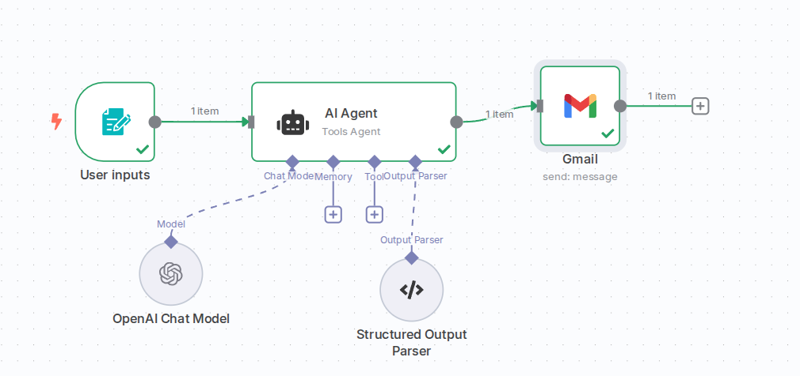
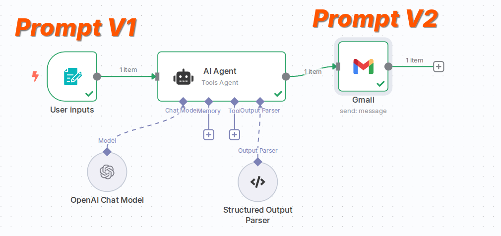

# System Prompt Tuning Agent

 

## Summary

The System Prompt Tuning Agent is an N8n workflow that automates the improvement of AI agent system prompts. This tool helps prompt engineers and AI developers quickly iterate and refine their system prompts by leveraging AI feedback on current performance issues.

The workflow takes user input about an existing AI agent configuration, analyzes what's working and what isn't, and then generates an improved system prompt tailored to address the identified issues. The results are delivered via email with a clear comparison between the original and improved prompts.

## How It Works

The workflow consists of a form-based input system that collects:

- **Required Information:**
  - Agent name
  - Agent purpose
  - What's working well
  - What's not working
  - Current system prompt

- **Optional Information:**
  - Example prompt (input)
  - Example output

This information is processed by an AI agent (using OpenAI's GPT-4o) configured with a specialized system prompt for prompt engineering. The agent evaluates the current system prompt, identifies improvement opportunities, and delivers:

1. An updated system prompt
2. A summary of improvements made

The results are formatted in JSON and sent to the user via email notification.

## When This Is Useful

This workflow is particularly valuable for:

- AI developers iterating on agent configurations
- Prompt engineers seeking to optimize system prompts
- Teams working on AI applications that require consistent agent behavior
- Anyone looking to reduce the time spent on system prompt refinement

By soliciting an outside AI perspective on your prompts, you can identify alternative approaches and improvements that might not be immediately apparent through manual iteration alone.

## Implementation

The N8n workflow uses:

- A form trigger node for data collection
- An AI agent node connected to OpenAI's GPT-4o model
- A structured output parser for JSON formatting
- An email delivery node for results notification

The entire process is automated, allowing for rapid iteration and testing of system prompts without manual rewriting.